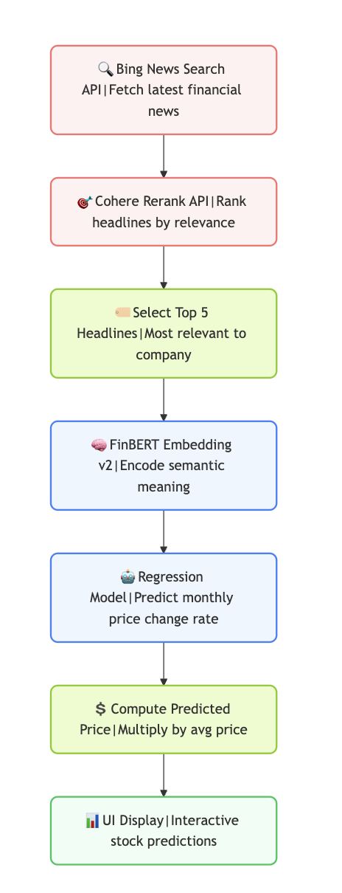

# 📈 Stock Prediction Based on News Articles

This project implements a FinBERT-based regression model that predicts monthly stock price changes based on financial news headlines. It also includes a RAG (Retrieval-Augmented Generation) system to make real-time predictions using live news data.

---

## 🔍 About

- A stock prediction pipeline using **BERT embeddings** and a **regression model** trained on financial headlines.
- Predicts **percentage change** in stock price from one month to the next.
- A **RAG system** is built on top to support real-time predictions from Bing Search news results.

---

## 🗃️ Datasets

### 📰 Financial News Headlines
- Source: Kaggle dataset (user-collected).
- JSONL format grouped by stock and month.

### 📊 Stock Price Data
- Source: [Polygon.io](https://polygon.io/)
- Provides `this_month_vw`, `next_month_vw`, and `percentage_change`.

---

## 🧠 Model Architecture

### FinBERT Regressor
- Uses **FinBERT** for contextual embedding of grouped headlines.
- A **linear layer** maps `[CLS]` token output to a single regression value.
- Only the regression head is trained; FinBERT is frozen.

```python
Input Headlines → Tokenizer → FinBERT → [CLS] Embedding → Linear Layer → % Change Prediction


